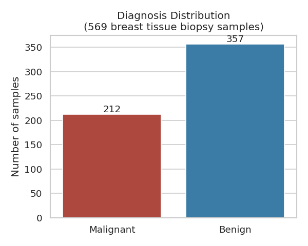
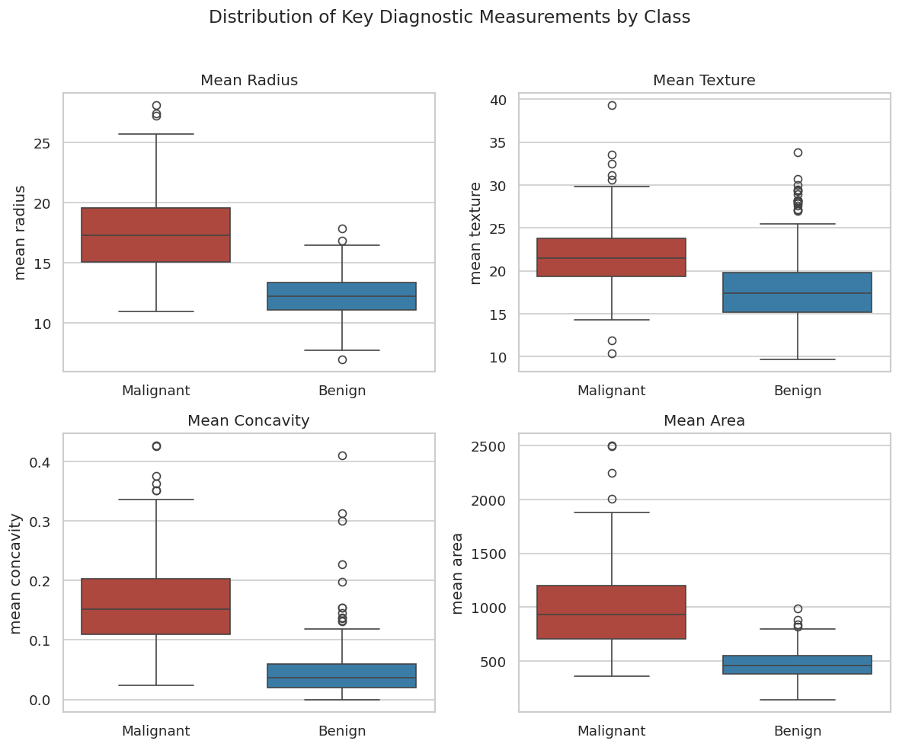
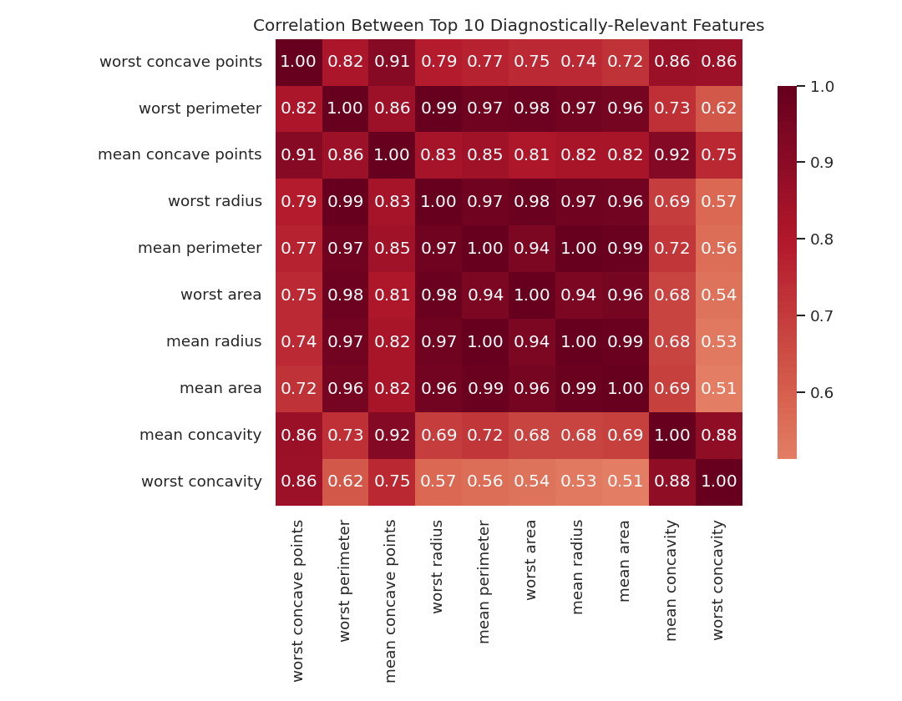
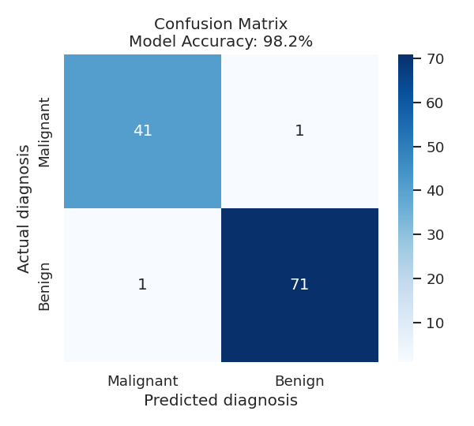
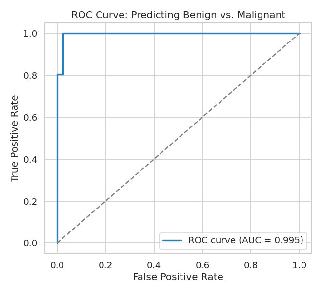
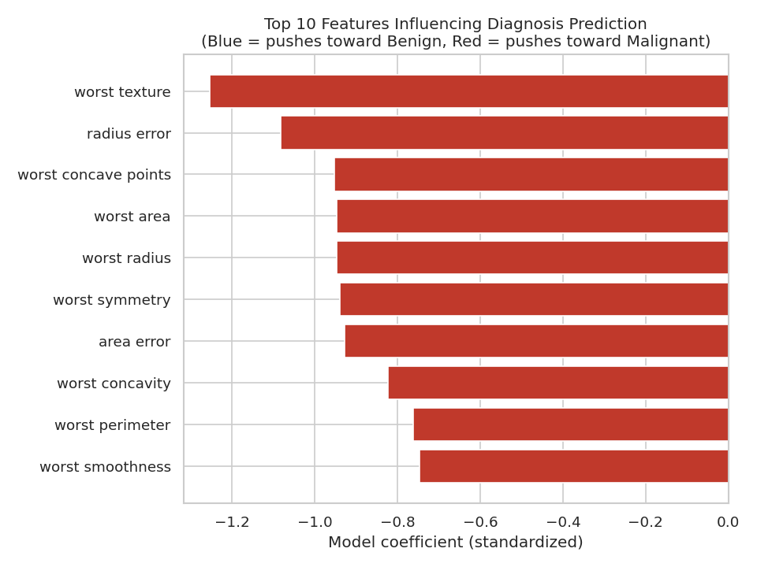

# Predicting Diagnosis from Breast Tissue Biopsy Measurements
### A Data Analysis Portfolio Project — Caspal Okelo

---

## Why I Built This

With 6+ years working in clinical diagnostics and laboratory quality systems in Kenya, I understand diagnostic data from the inside — how it's generated, what makes it reliable, and why accuracy matters for patient outcomes. This project combines that domain background with Python-based data analysis to show how statistical modeling can support diagnostic decision-making.

The dataset used here is the **Breast Cancer Wisconsin (Diagnostic) dataset**, a well-known public dataset containing measurements taken from digitized images of fine needle aspirate (FNA) biopsies of breast masses — 569 samples, each with 30 measurements describing cell nuclei characteristics (radius, texture, concavity, symmetry, etc.), labeled as **malignant** or **benign**.

---

## 1. Understanding the Data

The dataset contains 569 biopsy samples: **357 benign** and **212 malignant** cases.

This is a reasonably balanced dataset, which matters for building a reliable model — a heavily skewed dataset (e.g., 95% benign) can make a model look accurate while actually just predicting the majority class every time.

---

## 2. Exploring Key Diagnostic Measurements

Before modeling anything, I looked at how key measurements differ between malignant and benign samples:

A few things stand out immediately, consistent with clinical intuition:
- **Malignant samples have visibly larger mean radius and mean area** — larger, more irregular cell nuclei are a known indicator of malignancy.
- **Mean concavity is sharply higher in malignant samples** — more severe concave contours in cell boundaries is a recognized morphological marker.
- **Mean texture** shows a real but less dramatic separation between classes — it carries some signal but is noisier.

This step matters because it's where domain knowledge and data actually meet: the statistical pattern in the data lines up with real, known diagnostic markers rather than being an arbitrary correlation.

---

## 3. How Features Relate to Each Other

Several of the top features are strongly correlated with each other (e.g., mean radius, mean perimeter, and mean area — which makes geometric sense, since they all describe cell size in different ways). This is useful to know before modeling, since highly correlated features can make a model harder to interpret even if it still predicts well.

---

## 4. Building a Predictive Model

Using this data, I trained a **logistic regression model** to predict whether a sample is malignant or benign based on its measurements. The data was split into a training set (80%) and a held-out test set (20%) that the model never saw during training, to fairly evaluate performance on new samples.

**Result: 98.2% accuracy on the held-out test set.**

Out of 114 test samples, the model correctly classified 112 — with only 2 misclassifications. In a real diagnostic support context, this kind of error would need much closer scrutiny (a false negative on a malignant case is far costlier than a false positive), which is why the next chart matters.

The ROC curve shows the model separates the two classes very well — an AUC (area under the curve) close to 1.0 indicates strong discriminative ability across different decision thresholds, not just at the default 50% cutoff.

---

## 5. Which Measurements Matter Most

The model's strongest predictors align closely with established clinical markers: features related to **concave points, radius, and texture (worst-case values)** carry the most weight in distinguishing malignant from benign samples. This kind of alignment between a model's statistical output and known domain knowledge is what gives a model credibility beyond just its accuracy score.

---

## What This Demonstrates

- **Data cleaning and exploration** using pandas
- **Statistical visualization** using seaborn/matplotlib to surface real patterns
- **Predictive modeling** using scikit-learn (logistic regression, train/test evaluation)
- **Model evaluation** using accuracy, confusion matrices, ROC/AUC — not just a single headline number
- **Domain-informed interpretation** — connecting statistical results back to real diagnostic meaning, which is where a healthcare background adds real value over a purely technical analyst

---

## About Me

I'm a medical laboratory scientist and healthcare professional based in Nairobi, Kenya, with hands-on experience in clinical diagnostics, laboratory quality systems (ISO 15189, KENAS), and healthcare commercial operations. I'm building Python-based data analysis skills to bring statistical rigor to the kind of healthcare and diagnostic problems I've worked on directly for years.

**Available for:** healthcare/diagnostic data analysis, lab quality systems consulting, healthcare market research and reporting.

*Dataset source: Breast Cancer Wisconsin (Diagnostic) Data Set, UCI Machine Learning Repository / scikit-learn.*
